# Cryophile


This is Cryophile, the off-site backup solution for extremophiles written in Rust.

Cryophile has the following components (solid lines: control flow, dashed lines: data flow):

```mermaid
flowchart LR
  direction TB
  pubkey(public<br/>key) -.-> b2
  direction TB
  bbackupid(backup id) -.-> b3

  subgraph g7 ["`**cryophile restore**`"]
  r1[send<br/>restore<br/>request] --> r2[monitor<br/>restore<br/>queue]
  r2 --> r3[concatenate<br/>backup<br/>from queue<br/>⛓️]
  r3 --> r4[decrypt<br/>🔓]
  r4 --> r5[decompress<br/>📂]
  end

  subgraph g6 ["`**restore queue**`"]
  q2[📥]
  end

  subgraph g5 ["`**cryophile thaw**`"]
  t1[wait for<br/>incoming<br/>requests] --> t2[initiate<br/>restore]
  t2 --> t3[download<br/>backup<br/>from S3]
  t3 --> t1
  end

  subgraph g4 ["`**S3**`"]
  s1[🪣]
  end

  subgraph g3 ["`**cryophile freeze**`"]
  f1[monitor<br/>backup<br/>queue] --> f2[upload<br/>backup<br/>to S3]
  f2 --> f1
  end

  subgraph g2 ["`**backup queue**`"]
  q1[📤]
  end

  subgraph g1 ["`**cryophile backup**`"]
  b1[compress<br/>🗜️] --> b2[encrypt<br/>🔒]
  b2 --> b3[split<br/>⛓️‍💥]
  end

  rbackupid(backup id) -.-> r1
  input(input<br/>stream) -.-> b1
  seckey(secret<br/>key) -.-> r4
  r5 -.-> output(output<br/>stream)
  r1 -.- backupid(backup id) -.-> t1

  b3 -.-> g2
  g2 -.-> f2
  f2 -.-> g4
  t3 -.-> g6

  r2 -.-> g6
  g6 -.-> r3

  t2 -.-> g4
  g4 -.-> t3

  f1 -.-> g2
```



To sum up:

- backup:    🗜️  ⇨  🔒  ⇨ ⛓️‍💥 ⇨ 📤
- freeze:    📤  ⇨ 🧊🪣
- thaw:    🪣💦  ⇨  📥
- restore:   📥  ⇨  ⛓️  ⇨  🔓  ⇨ 📂

## Backup and Restore

```shell
dd if=/dev/random count=4096 \
   | CRYOPHILE_LOG_STYLE= CRYOPHILE_LOG='warn,cryophile=trace' RUST_BACKTRACE=full cargo run -- -S /tmp backup -v UUID -p PREFIX
```

If notify fails, we need to bump max_user_instances, see <https://stackoverflow.com/a/71082431/2982090>

```shell
sudo sysctl fs.inotify.max_user_instances=512
```

## Generate encryption key and certificate

```shell
sq key generate --cipher-suite cv25519 --can-encrypt storage --cannot-authenticate --cannot-sign --output cryophile-key.pgp
```

```shell
sq key extract-cert --output cryophile-cert.pgp cryophile-key.pgp
```

```shell
sq inspect cryophile-key.pgp
cryophile-key.pgp: Transferable Secret Key.

    Fingerprint: 06A457651A730003DCC7BB20E1A8CDDAF1BDCEB3
Public-key algo: EdDSA
Public-key size: 256 bits
     Secret key: Unencrypted
  Creation time: 2022-12-26 20:55:41 UTC
Expiration time: 2025-12-26 14:22:02 UTC (creation time + P1095DT62781S)
      Key flags: certification

         Subkey: 62CC3D4C18C65A707CEC689DB1E96BA621037299
Public-key algo: ECDH
Public-key size: 256 bits
     Secret key: Unencrypted
  Creation time: 2022-12-26 20:55:41 UTC
Expiration time: 2025-12-26 14:22:02 UTC (creation time + P1095DT62781S)
      Key flags: data-at-rest encryption
```

```shell
sq inspect cryophile-cert.pgp
cryophile-cert.pgp: OpenPGP Certificate.

    Fingerprint: 06A457651A730003DCC7BB20E1A8CDDAF1BDCEB3
Public-key algo: EdDSA
Public-key size: 256 bits
  Creation time: 2022-12-26 20:55:41 UTC
Expiration time: 2025-12-26 14:22:02 UTC (creation time + P1095DT62781S)
      Key flags: certification

         Subkey: 62CC3D4C18C65A707CEC689DB1E96BA621037299
Public-key algo: ECDH
Public-key size: 256 bits
  Creation time: 2022-12-26 20:55:41 UTC
Expiration time: 2025-12-26 14:22:02 UTC (creation time + P1095DT62781S)
      Key flags: data-at-rest encryption

```

## Configuration

Default configuration will be read from
`~/.config/cryophile/cryophile.toml`, and if this file is not
available then `/etc/cryophile/cryophile.toml` will be tried
next. If both fail to exist, the standard configuration will be
empty. If you pass `--config path/to/cryophile.toml`, `cryophile`
will only read `path/to/cryophile.toml` and fail if the file does not
exist.

## Update dependencies

```shell
cargo update -v
```

## Format code

```shell
cargo fmt -v --all
```

## Static checks

```shell
cargo check
cargo clippy
```

## Build

```shell
cargo build
```

## Test

```shell
RUST_BACKTRACE=full cargo test -- --nocapture
```

## Benchmark

```shell
cargo bench
```

## License

Cryophile is dual-licensed under the Apache License, Version 2.0
[LICENSE-APACHE](LICENSE-APACHE) or
<http://www.apache.org/licenses/LICENSE-2.0> or the MIT license
[LICENSE-MIT](LICENSE-MIT) or <http://opensource.org/licenses/MIT>, at
your option.
