# Cryophile

[](https://crates.io/crates/cryophile)
[](https://docs.rs/cryophile)
[](https://github.com/tkren/cryophile/blob/main/COPYRIGHT)


<figure>
  
  <figcaption>Morphological details of Echiniscus insularis sp. nov.: <a href="https://commons.wikimedia.org/wiki/File:Echiniscus_insularis_(10.3897-evolsyst.5.59997)_Figure_6_(white_background).jpg">Kiosya Y, Vončina K, Gąsiorek P (2021) Echiniscidae in the Mascarenes: the wonders of Mauritius. Evolutionary Systematics 5(1): 93-120. https://doi.org/10.3897/evolsyst.5.59997</a>, <a href="https://creativecommons.org/licenses/by/4.0">CC BY 4.0</a>, via Wikimedia Commons</figcaption>
</figure>

---

This is **Cryophile**, the off-site backup solution for extremophiles written in Rust.

**Cryophile** will take an input stream (or one file) and encrypts the input data, and then
queues the resulting end-to-end encrypted archive for upload to a (hosted) cloud storage service implementing
the S3 API (e.g., AWS S3, Cloudflare R2, Google Cloud Storage XML API, etc.). When using Amazon S3, the
[storage class](https://aws.amazon.com/s3/storage-classes/) of the archive can be configured
(default is `Amazon S3 Glacier Flexible Retrieval`).

Restoring a backup is then performing the dual:

- initiate a restore for backup archives stored in one of the [Amazon S3 Glacier storage classes](https://aws.amazon.com/s3/storage-classes/glacier/),
- download archive files,
- decryption of the archive, and
- then send the result to stdout or to a file for further processing.

**Cryophile** has the following components (solid lines: control flow, dashed lines: data flow):

```mermaid
---
title: Cryophile Architecture
---
flowchart LR
  direction TB
  pubkey("public key<br/>📜") -.-> b2
  direction TB
  bbackupid("backup id") -.-> b3

  subgraph g7 ["cryophile restore"]
  r1[send<br/>restore<br/>request] --> r2["monitor<br/>restore<br/>queue"]
  r2 --> r3["concatenate<br/>⛓️"]
  r3 --> r4["decrypt<br/>🔓"]
  r4 --> r5["decompress<br/>📂"]
  end

  subgraph g6 ["restore queue"]
  q2["📥"]
  end

  subgraph g5 ["cryophile thaw"]
  t1["wait for<br/>incoming<br/>requests"] --> t2["initiate<br/>restore"]
  t2 --> t3["download<br/>backup<br/>from S3"]
  t3 --> t1
  end

  subgraph g4 ["S3"]
  s1["🪣"]
  end

  subgraph g3 ["cryophile freeze"]
  f1["monitor<br/>backup<br/>queue"] --> f2["upload<br/>backup<br/>to S3"]
  f2 --> f1
  end

  subgraph g2 ["backup queue"]
  q1["📤"]
  end

  subgraph g1 ["cryophile backup"]
  b1["compress<br/>🗜️"] --> b2["encrypt<br/>🔒"]
  b2 --> b3["split<br/>⛓️‍💥"]
  end

  rbackupid("backup id") -.-> r1
  input("input<br/>stream") -.-> b1
  seckey("secret key<br/>🔑") -.-> r4
  r5 -.-> output("output<br/>stream")
  r1 -.- backupid("backup id") -.-> t1

  b3 -.-> g2
  g2 -.-> f2
  f2 -.-> g4
  t3 -.-> g6

  r2 -.-> g6
  g6 -.-> r3

  t2 -.-> g4
  g4 -.-> t3

  f1 -.-> g2
```



To sum up:

- backup:    🗜️  ⇨  🔒  ⇨ ⛓️‍💥 ⇨ 📤
- freeze:    📤  ⇨ 🧊🪣
- thaw:    🪣💦  ⇨  📥
- restore:   📥  ⇨  ⛓️  ⇨  🔓  ⇨ 📂

## Install

1. [Install Rust and cargo](https://www.rust-lang.org/tools/install)
2. Install `cryophile` by running

```shell
cargo install --git https://github.com/tkren/cryophile cryophile
```

## Concepts and Terminology

**Archive**
: Encrypted backup stream as numbered fragment files. Archives can be found in _backup/restore queues_ or in a _vault_.

**Backup ID**
: Consists of a _vault_, an optional _prefix_, and a _[ULID](https://github.com/ulid/spec)_.

**Backup queue** / **Restore queue**
: Located in `/var/spool/cryophile`.

**ULID**
: Every backup _archive_ has an associated [ULID](https://github.com/ulid/spec) of the form `TTTTTTTTTTRRRRRRRRRRRRRRR`, where `TTTTTTTTTT` encodes a 48 bit timestamp and `RRRRRRRRRRRRRRR` encodes an 80 bit random number.

**Prefix**
: Optional [prefix](https://docs.aws.amazon.com/AmazonS3/latest/userguide/using-prefixes.html) string for grouping backup archives. Since S3 object key names can have at most 1024 bytes, the length of a prefix is limited by 1024 - (len(ULID) - 1) - len(max_fragment) = 997 - len(max_fragment), where max_fragment is the number of the last fragment file. Since each S3 object can hold at most 5 TB, larger backup archives need to be split over multiple fragments.

**Vault**
: A [UUID](https://en.wikipedia.org/wiki/Universally_unique_identifier) that (usually) stands for an S3 bucket hosting cryophile's backup archives.

## Backup and Restore

```shell
dd if=/dev/random count=4096 \
   | CRYOPHILE_LOG_STYLE= CRYOPHILE_LOG='warn,cryophile=trace' RUST_BACKTRACE=full \
     cryophile -S /tmp backup -v VAULT -p PREFIX
```

If notify fails, we need to bump max_user_instances, see <https://stackoverflow.com/a/71082431/2982090>

```shell
sudo sysctl fs.inotify.max_user_instances=512
```

### Provide passphrase for unlocking secret key

```shell
# get passphrase from environment variable PASS_ENV
exec 4<<<"${PASS_ENV}"
```

```shell
# get passphrase from password manager
exec 4< <(op item get --fields label=password k6cnmqehivmdchfmsprtahl2ze)
```

```shell
# use graphical password dialog
exec 4< <(ssh-askpass)
```

```shell
cryophile restore --keyring=cryophile-key.pgp --pass-fd=4 \
                  --vault=VAULT --prefix=PREFIX --ulid=ULID
```

### Create backup from FIFO input stream

```shell
mkfifo /path/to/cryophile.fifo
```

```shell
tar -c -f /path/to/cryophile.fifo -C backup_dir .
```

```shell
cryophile backup --vault VAULT --prefix PREFIX \
          --keyring cryophile-key.gpg \
          --compression lz4 \
          --input /path/to/cryophile.fifo
```

## Generate encryption key and certificate

### Using sequoia-sq

Create a minimal key for backup encryption:

```shell
sq key generate --cipher-suite cv25519 --can-encrypt storage \
                --cannot-authenticate --cannot-sign \
                --output cryophile-key.pgp
```

```shell
sq key extract-cert --output cryophile-cert.pgp cryophile-key.pgp
```

### Using sequoia-sop

```shell
sqop generate-key "cryophile" > cryophile-key.pgp
```

```shell
sqop extract-cert < cryophile-key.pgp > cryophile-cert.pgp
```

### Using GnuPG

```shell
gpg --quick-gen-key "cryophile" ed25519 cert never
```

This will print the key fingerprint that needs to be used later to add subkeys and export keys:

```shell
…
pub   ed25519 2023-12-31 [C]
      B22CA97BC8B419236E8918DF78670821851E5B0F
uid                      cryophile
```

```shell
gpg --quick-add-key B22CA97BC8B419236E8918DF78670821851E5B0F cv25519 encr never
```

```shell
gpg --export-secret-keys B22CA97BC8B419236E8918DF78670821851E5B0F --output cryophile-key.pgp
```

```shell
gpg --export B22CA97BC8B419236E8918DF78670821851E5B0F --output cryophile-cert.pgp
```

## Configuration

Default configuration will be read from
`~/.config/cryophile/cryophile.toml`, and if this file is not
available then `/etc/cryophile/cryophile.toml` will be tried
next. If both fail to exist, the standard configuration will be
empty. If you pass `--config path/to/cryophile.toml`, `cryophile`
will only read `path/to/cryophile.toml` and fail if the file does not
exist.

## Environment Variables

**`CRYOPHILE_LOG`**
: Allows to specify minimum log level: `error`, `warn`, `info` (default log level), `debug`, `trace`, `off`. See [env_logger](https://docs.rs/env_logger/latest/env_logger/#enabling-logging) documentation for more details.

**`CRYOPHILE_LOG_STYLE`**
: Specify when to log with style: `auto`, `always`, `never`

## Development

### Inject freeze queue to restore queue

```shell
find /var/spool/cryophile/VAULT/PREFIX/ULID -type f -not -name "chunk.0" -printf "%f\n" \
    | sort -n -t. -k2 \
    | shuf \
    | xargs -I{} ln -v /var/spool/cryophile/{freeze,restore}/VAULT/PREFIX/ULID/{}

touch /var/spool/cryophile/restore/VAULT/PREFIX/ULID/chunk.0
```

### Update dependencies

```shell
cargo update -v
```

### Format code

```shell
cargo fmt -v --all
```

### Static checks

```shell
cargo check
cargo clippy
```

### Build

```shell
cargo build
```

### Test

```shell
RUST_BACKTRACE=full cargo test -- --nocapture
```

### Benchmark

```shell
cargo bench
```

## License

Cryophile is dual-licensed under the Apache License, Version 2.0
([LICENSE-APACHE](LICENSE-APACHE) or
<http://www.apache.org/licenses/LICENSE-2.0>) or the MIT license
([LICENSE-MIT](LICENSE-MIT) or <http://opensource.org/licenses/MIT>), at
your option.

`SPDX-License-Identifier: Apache-2.0 OR MIT`
